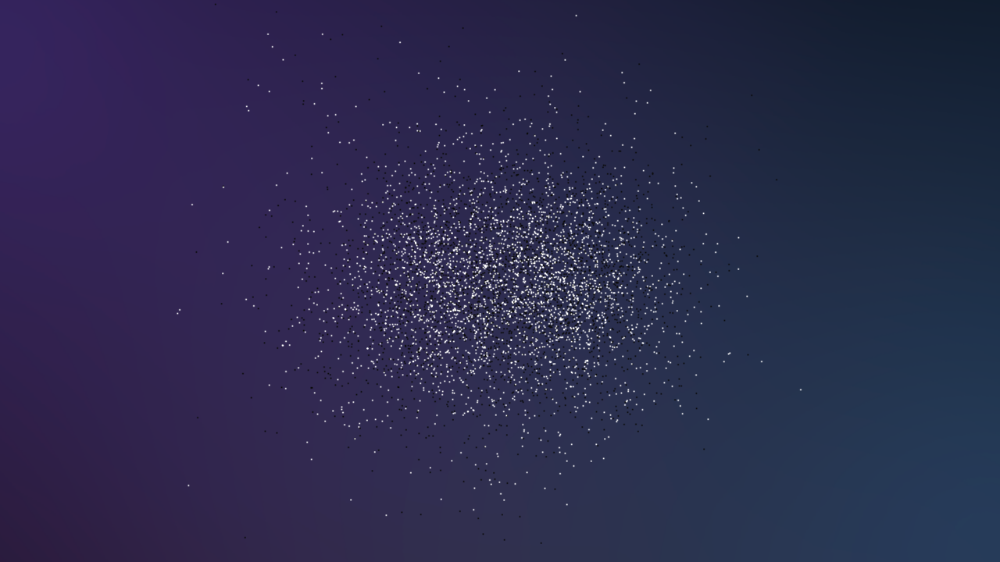
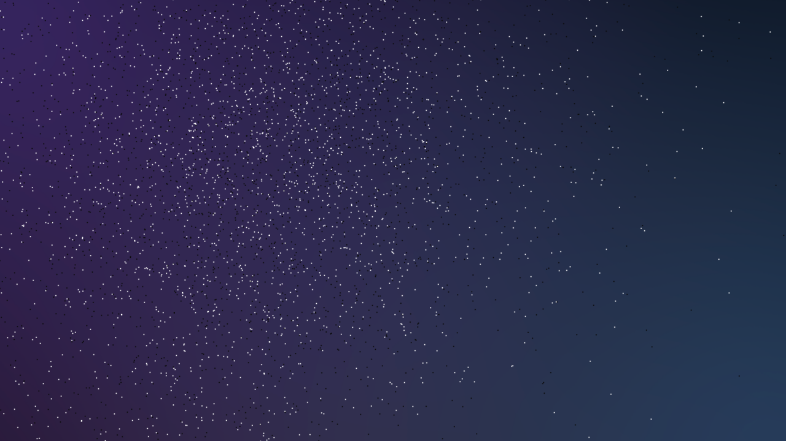

# Moonshot — Vision

> A screean app is a normal React app at rest. Particles are the choreography that plays *between* component states. The DOM button is the truth; particles are the transformation between truths.

## Why this doc exists

The first moonshot attempt (commit `c74720b`) inverted this premise. It built UIs *out of* particle clouds — every button, every text field, every label rendered permanently as rasterized matter. The result was UI that read as "amber smudge shaped vaguely like a button" instead of as a button.

The right model — proven by `src/demos/html-interop/` and now `src/demos/html-interop-2/` — is the **dissolve cycle**: a real DOM component is the source of truth; on interaction it rasterizes into particles, plays a physics moment, and reforms back to DOM. Particles are theater between two known DOM states.

This doc fixes the model in writing so a future contributor (human or agent) can re-anchor it without rediscovering the lesson the hard way.

---

## The dissolve cycle — four canonical frames

These frames are captured from `/html-interop.html` (the canonical reference demo) using `screean/perf/capture-frames.mjs`. They are the **success baseline** for any new screen built on the moonshot architecture. If your screen can't show these four frames, it isn't doing screean — it's just a particle cloud.

### Frame 1 — `rest` (DOM is canonical)


A real `<button>`, fully styled, focusable, screen-reader visible, pixel-perfect. Looks like any well-designed UI. **No particles are drawn.** The canvas is idle. The user sees only DOM.

### Frame 2 — `dissolving` (matter at the silhouette)



The instant after click. The DOM button is set to `opacity: 0`. ~6,000 particles are spawned at the rasterized silhouette of the (now invisible) button — `frame one IS the button` — and a radial impulse fires from the button's center. The cluster is dense and centered: matter that *was* the component, just freed.

### Frame 3 — `particles` (free physics)



Free physics for ~1.5 seconds. Particles drift, scatter, get pulled by the cursor (if pointer attraction is on), respond to neighbors. The button doesn't exist anywhere right now — not in DOM (opacity:0), not in particles (they've left the silhouette). This is the "matter without form" interval.

### Frame 4 — `reformed` (DOM is canonical again)


After the particle phase, particles lerp back to the silhouette (`returning`, ~50ms) and pin in place. The DOM button fades back in over the pinned silhouette (`reforming`, ~100ms). Particles are then cleared and the DOM button regains pointer-events. **Indistinguishable from Frame 1.** The round-trip closed cleanly.

> The `returning` and `reforming` phases sit inside a 150ms window between `particles` and `rest`. They're visible to the user as a single perceptual beat — "particles snap back, button is here again." Capturing them as separate frames in screenshots is unreliable; they're documented in code (`src/demos/html-interop/main.tsx` `tickState`) rather than as static images.

---

## Glossary

| Term | Meaning |
|---|---|
| **rest** | The component exists as DOM only. Canvas is idle. Default state. |
| **dissolving** | One-frame burst: DOM → opacity 0; particles spawned at silhouette; radial impulse fires. Always exactly 1 tick. |
| **particles** | Free physics. Particles obey forces (spring, drag, shimmer, repel, optionally pointer attraction). DOM is invisible. Configurable duration; default 1500ms. |
| **returning** | Particles lerp back toward their original silhouette positions. Physics is suspended; positions are written directly. ~50ms. |
| **reforming** | DOM opacity fades 0 → 1 over the pinned-in-place particle silhouette. ~100ms. |
| **silhouette** | The rasterized pixel mask of the rendered DOM element. Produced by `bitmapFieldFromElement`. |
| **swap** | A two-component variant: particles dissolved from element A reform on element B. Useful for "click this button → that button receives the message" choreography. |
| **thwack** | A one-shot impulse that doesn't run a full state machine — particles already in flight get a kick. For micro-feedback like "sent!" or "error!" pulses. |

---

## What the framework gives consumers

The moonshot ships these primitives, all imperative on a shared canvas:

```ts
const canvas = useCanvas();

// One-component round trip (the html-interop demo)
await canvas.dissolve(buttonRef.current);

// Two-component swap (the moonshot's reason to exist)
await canvas.swap(fromRef.current, toRef.current);

// Single-shot impulse during an existing particle phase
canvas.thwack(x, y, strength);
```

Plus React hooks that wrap the imperatives for the common cases:

```ts
const dissolve = useDissolve(buttonRef);     // returns () => Promise<void>
const swap     = useSwap(fromRef, toRef);    // returns () => Promise<void>
```

---

## What it explicitly does NOT do

- **It does not render UI.** No particle-shaped buttons, no rasterized text fields, no canvas-rendered headlines. The UI is React. Particles are the *transition between* React states.
- **It does not own state.** React owns the component state. The canvas owns the particle state. They meet only at dissolve/swap moments.
- **It does not require a custom reconciler.** No mirror trees, no scene-graph DSLs, no JSX-as-spec patterns. Just refs and an imperative API.

---

## Force preset

The dissolve cycle uses `feels.taut` from screean (see `screean/src/feel/presets.ts`). The character is "particles snap to silhouette and pin" — high spring stiffness (140), heavy damping (16), low shimmer (3). Damping ratio ≈ 0.68, which gives a fast, snappy bounce that settles cleanly. Other feels (`balanced`, `dreamy`, etc.) work but visibly change the personality of the transition.

For per-screen overrides — say a "transmit" submit button that wants a chaotic dispersal — pass an `opts.feel` to `dissolve()`/`swap()`.

---

## Reference demos

- **`/html-interop.html`** — Phase 3a interactive demo. The reference. Built early in the project; uses raw `new World()` + inline force composition. Behaviorally definitive.
- **`/html-interop-2.html`** — Same demo, ported onto `feels.taut`. Proves the preset is a faithful port of the hand-tuned values.
- **`/moonshot/test`** — Two-button **swap** demo. Built on the new imperative canvas API. Strip B of the success comparison; proves the cross-element handoff that html-interop can't show.

---

## Strip B — `/moonshot/test` (cross-element swap)

This is the moonshot's reason to exist: not a self-dissolve round-trip (which html-interop already nailed), but a **handoff** — particles dissolved from button A reform as button B at a different screen position. Same `feels.taut` preset, same state machine, generalized to take a separate INTO target.

### Frame 1 — `rest`


The "Send →" button on the left, normal styled DOM. Button B ("← Received") exists in the DOM but is at `opacity: 0` so the user only sees A.

### Frame 2 — `arriving`


Particles reconstituting at the INTO silhouette (button B, on the right) just before the DOM fades in. The "in-flight" moment between FROM and INTO can't be captured by Playwright reliably — at `feels.taut` (K=140, ζ≈0.68) the cloud crosses 1000px in ~120ms, faster than the ~200ms screenshot latency. The visually load-bearing frame is *this* one: "particles forming the destination."

### Frame 3 — `reformed`


"← Received" reformed at the right position, fully interactive. The cycle closed cleanly. Click again and the swap reverses (B → A).

---

## Implementation notes from building Strip B

Two real bugs surfaced and are documented here so future contributors don't reinvent them:

1. **`dt` clamp is mandatory.** The RAF loop must clamp `dt = Math.min(0.05, ...)`. Without it, a single slow frame compounds with `feels.taut`'s stiff spring (K=140) into NaN coordinates and a tab freeze. The first refactor of `canvas.tsx` dropped this clamp; the test page locked up immediately.

2. **INTO must be visible during rasterization.** `bitmapFieldFromElement` via the foreignObject path respects `opacity: 0` → produces an empty mask → `field.sample()` returns no points → spring targets fall back to FROM positions → particles cluster at the source and overload `neighborRepel`. The canvas now temporarily flips `into.style.opacity = '1'` for the duration of the rasterization call, then restores. The blip is invisible to the user because the canvas owns the lifecycle.

---

## Comparison strips (success criteria)

When a new screen ships, the contributor produces a **side-by-side strip** comparing the canonical frames against the html-interop / `/moonshot/test` references. If the strip looks visibly worse than these baselines at any frame, the screen isn't ready.

Both strips are regenerated by:

```bash
cd screean/
node perf/capture-frames.mjs
```

(Requires the dev server at `http://localhost:3100/`.)
